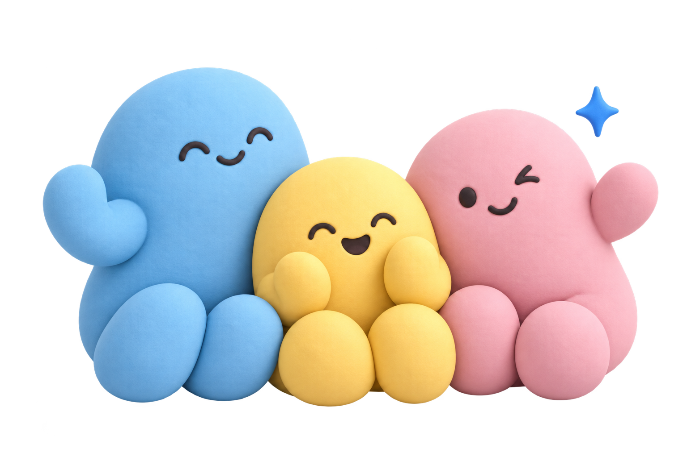
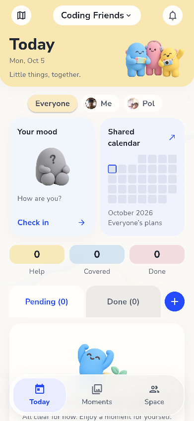
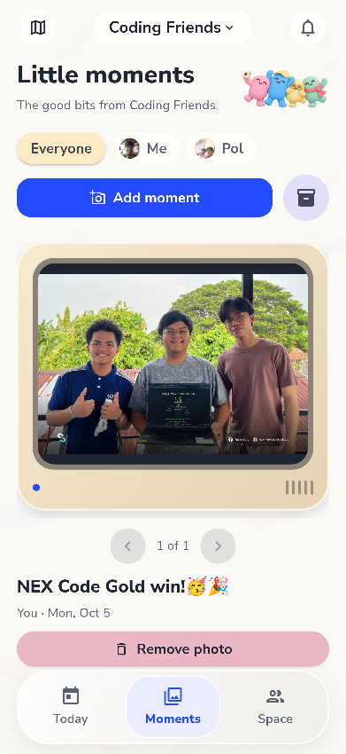
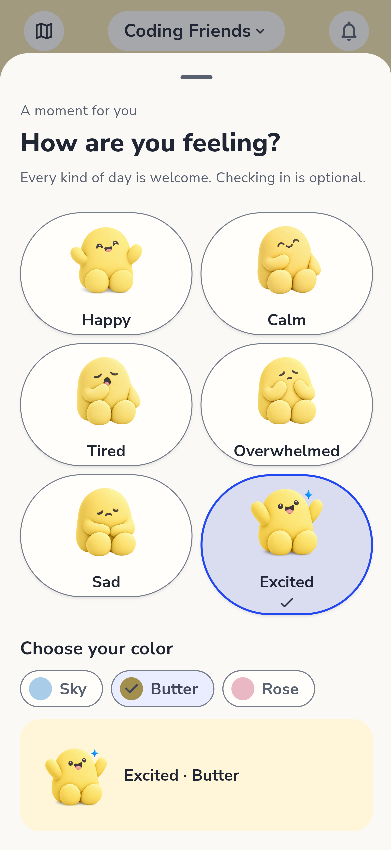
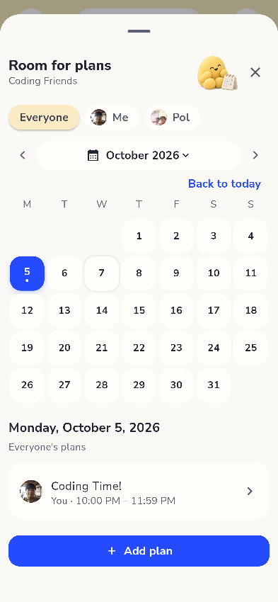

<div align="center">


# Stewardie

### *Your people. Your plans. Your little moments.*

A cozy, tactile shared-life companion app for families, housemates, dormmates, and crews.

[](https://www.gnu.org/licenses/agpl-3.0)
[](#platform--availability)
[](https://flutter.dev)
[](#soft-pop-design-system)
[](#platform--availability)

[**Live Interactive Demo**](stewardie-website/index.html) · [**Download Android APK**](https://github.com/manalogadiel/stewardie/releases/latest) · [**Report Issue**](https://github.com/manalogadiel/stewardie/issues)

<br/>



</div>

---

## 📖 Overview

Most shared household organizers and group managers feel either like cold enterprise ticketing tools or chaotic group chats where important tasks get buried under memes. 

**Stewardie changes that dynamic completely.**

Stewardie transforms daily responsibilities into seamless teamwork and everyday routines into shared celebration. Designed with a signature **Soft Pop** clay aesthetic, warm pastel hues, and tactile micro-interactions, Stewardie brings warmth, clarity, and delight to shared living.

---

## ✨ Key Features

<table>
  <tr>
    <td width="50%" valign="top">
      <h3 align="center">📅 Your Today</h3>
      <p align="center"></p>
      <p><strong>Zero-friction responsibility.</strong> Shared daily view where tasks, chores, and updates flow naturally without nagging or stress.</p>
    </td>
    <td width="50%" valign="top">
      <h3 align="center">📸 Little Moments</h3>
      <p align="center"></p>
      <p><strong>Capture the good bits.</strong> Share candid photo memories and daily snaps with your group instantly in a private photo roll.</p>
    </td>
  </tr>
  <tr>
    <td width="50%" valign="top">
      <h3 align="center">🧸 Daily Moods</h3>
      <p align="center"></p>
      <p><strong>Low-pressure check-ins.</strong> Express how you feel with tactile clay companions (Calm, Happy, Tired, Overwhelmed, Sad, Excited).</p>
    </td>
    <td width="50%" valign="top">
      <h3 align="center">🗓️ Room for Plans</h3>
      <p align="center"></p>
      <p><strong>Smart Shared Calendar.</strong> A unified timeline for everyone. Coordinate shared dinners, outings, bills, and milestones.</p>
    </td>
  </tr>
</table>

### 🏡 Shared Spaces & Dynamic Memberships
- **Tailored Spaces:** Create dedicated spaces for your Family, Housemates, Friends, or Crew.
- **Easy Onboarding:** Invite members seamlessly through invite codes, universal links, or built-in QR code scanning.
- **Privacy-First:** Granular member permissions and local/cloud privacy controls safeguard personal memories and locations.

---

## 🎨 Soft Pop Design System

Stewardie was intentionally crafted to feel human, soft, and inviting rather than corporate:

- **Clay Companions:** Friendly mascots with tiny charcoal expressions and gentle diffuse lighting.
- **Warm Pastel Palette:**
  - Sky Blue (`#A8D1E7`) & Butter Yellow (`#F9E2AF`)
  - Soft Rose (`#F4B8E4`) & Gentle Mint
  - Warm Cream Canvas (`#FFFDF9`) & Charcoal Typography (`#3B3833`)
- **Tactile Physics:** Interactive jelly-spring physics for web decor and satisfying micro-animations on mobile.
- **Friendly Typography:** Google Fonts [Fredoka](https://fonts.google.com/specimen/Fredoka) for playful headers paired with [Nunito Sans](https://fonts.google.com/specimen/Nunito+Sans) for clean legibility.

---

## 📂 Repository Structure

```plaintext
stewardie-app/
├── README.md                      # Repository overview & documentation
├── .gitignore                     # Git ignore rules
└── stewardie-website/             # Showcase website & web demo runtime
    ├── index.html                 # Responsive product landing page
    ├── style.css                  # Soft Pop design system & jelly animations
    ├── script.js                  # Spring physics engine & demo loader
    ├── screenshot.js              # Headless Chrome script for UI captures
    ├── vercel.json                # Vercel deployment & WASM header config
    ├── DEMO-FIXES.md              # Technical notes on web demo shims
    ├── app/                       # Compiled interactive Flutter Web demo
    │   ├── index.html             # Demo iframe entrypoint
    │   ├── demo-runtime.js        # Browser webcam & persistent avatar shims
    │   ├── flutter.js             # Flutter Web engine loader
    │   ├── flutter_bootstrap.js   # CanvasKit bootstrap configuration
    │   └── main.dart.js           # Compiled application bundle
    └── assets/                    # Static creative assets
        ├── branding/              # Icons, wordmarks, store badges
        ├── illustrations/         # Soft Pop clay mascots, moods & scenes
        ├── screenshots/           # Application screenshots
        ├── fonts/                 # Variable typeface assets (Nunito Sans)
        └── sounds/                # Tactile application sound effects
```

---

## 🚀 Running the Website Locally

You can preview the landing page and the embedded interactive demo using any local static HTTP server.

### Option 1: Using Python
```bash
cd stewardie-website
python -m http.server 8000
```
Then visit [`http://localhost:8000`](http://localhost:8000) in your browser.

### Option 2: Using Node.js (`serve` / `npx`)
```bash
cd stewardie-website
npx serve .
```

### Option 3: Using VS Code Live Server
Open the `stewardie-website/` directory in VS Code and click **"Go Live"** from the status bar.

> [!NOTE]
> The embedded demo inside the phone frame runs a CanvasKit/HTML5 Flutter Web build. When running locally or in development, ensure your browser has camera permissions enabled if you test the webcam feature in the demo.

---

## 📱 Platform & Availability

| Platform | Channel | Status |
|:---|:---|:---|
| **Android** | [GitHub Releases](https://github.com/manalogadiel/stewardie/releases/latest) | Available (Direct APK) |
| **Android** | Google Play Store | *Coming Soon* |
| **Web** | In-Browser Demo (`stewardie-website/app/`) | Live Interactive Preview |

---

## 🛠️ Deployment

The landing page and interactive demo are optimized for modern static hosting providers like **Vercel** or **GitHub Pages**:

- **Vercel Configuration:** Pre-configured in [`stewardie-website/vercel.json`](stewardie-website/vercel.json) to serve `.wasm` assets with the appropriate `application/wasm` MIME type.
- **Service Worker Caching:** Flutter Web assets and CanvasKit bundles are precached for fast repeat loads.

---

## 📄 License & Attribution

- **License:** GNU Affero General Public License v3.0 ([AGPL-3.0](https://www.gnu.org/licenses/agpl-3.0))
- **Copyright:** © 2026 iDIELogies. All rights reserved.
- **Fonts & Third-Party Assets:**
  - Nunito Sans: SIL Open Font License 1.1
  - Material Icons: Apache License 2.0
  - Clay Mascot Artwork: Original Soft Pop collection created for Stewardie
